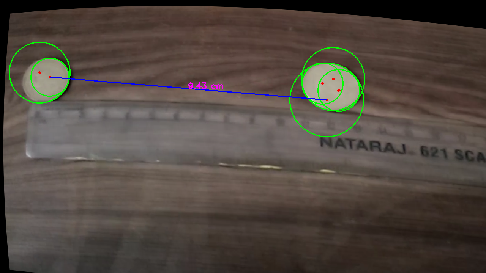

Spatial Lens: Camera Calibration & Distance Measurement

Spatial Lens is a computer vision project that enables accurate distance measurement between circular objects in real-time using a calibrated camera. The system first calibrates a camera using chessboard pattern recognition, then applies the calibration to perform precise distance measurements between circular objects.

## Project Overview

This project consists of several key components:
- Camera calibration using chessboard patterns
- Image augmentation to increase the training dataset
- Real-time distance measurement between circular objects

## Features

- **Camera Calibration**: Removes lens distortion for accurate measurements
- **Image Augmentation**: Increases dataset size with variations of original images
- **Real-time Object Detection**: Identifies circular objects in live video feed
- **Distance Measurement**: Calculates real-world distances between detected objects
- **Visual Feedback**: Displays measurements on-screen with visual indicators

## Requirements

- Python 3.x
- OpenCV (cv2)
- NumPy
- PIL (Pillow)

## Project Structure
    Spatial_Lens/
    ├── Augmentated_images/ # (Optional) Image dataset
    ├── chessboard_images/ # Calibration images
    ├── augementation.py # [Optional] Data augment script
    ├── CameraCallibration.py # Calibration script using chessboard pattern
    ├── Distance_measurement.py # Circle detection and distance logic
    ├── live_camera_calibration.npz # Stored calibration parameters
    ├── preprocessing.py # Preprocessing routines
    ├── debug_frame.jpg # Debug frame for circle detection
    ├── Circular Object Distance_*.jpg # Output snapshot
    └── README.md # You're here!

---

## 📌 What It Does

1. **Calibrates the webcam** using chessboard images to obtain the camera matrix and distortion coefficients.
2. **Undistorts live video frames** to correct optical distortion.
3. **Detects circular objects** using the Hough Circle Transform.
4. **Estimates real-world scale** using a known reference object (e.g. a 2.5 cm coin).
5. **Computes the distance** (in cm) between two detected circles using pixel-to-cm conversion.

---

## 📐 Core Math & Logic

### 1. Camera Calibration (One-Time)

OpenCV estimates the intrinsic camera matrix \( K \) and distortion coefficients \( D \) using a grid of known square size.

- Input: Multiple images of a 2D chessboard
- Output: 
  - `camera_matrix` (focal lengths, optical center)
  - `dist_coeffs` (radial/tangential distortion)

Once computed, these are saved to `live_camera_calibration.npz`.

---

### 2. Circle Detection

On each webcam frame:

- Convert to grayscale  
- Apply Gaussian blur  
- Detect circles using `cv2.HoughCircles()`:

```python
circles = cv2.HoughCircles(blurred, cv2.HOUGH_GRADIENT,
                           dp=1.2, minDist=30,
                           param1=50, param2=30,
                           minRadius=10, maxRadius=100)
```
---

### 3. Distance Estimation

```python
Given:
- A known circle (e.g. coin) of diameter dₘₑₐₗ cm
- Its detected radius in pixels rₚₓ

The pixel-to-cm scale is:
    pixels_per_cm = rₚₓ / (dₘₑₐₗ / 2)


Now, for two circle centers:
    distanceₚₓ = √[(x₂ - x₁)² + (y₂ - y₁)²] distanceₘₘ = distanceₚₓ / pixels_per_cm
```


✅ This gives real-world distance in centimeters.

---

## 🖼️ Sample Output


*Screenshot showing two detected circles and the measured distance overlay*

## 🎥 Live Demo

<!-- 📹 PLACEHOLDER: EMBED OR LINK TO DEMO VIDEO HERE -->
*Short video showing real-time detection and distance measurement.*

## 🚀 How to Run the Project

### Prerequisites
- Python 3.x
- Required libraries: `opencv-python`, `numpy`, `pillow`

You can install the required libraries using pip:

    pip install opencv-python numpy pillow


### Step 1: Prepare Calibration Images
1. Print a standard chessboard pattern (9x6 inner corners recommended)
2. Take 20-30 photos of the chessboard from different angles with your camera
3. Place these images in the `chessboard_images` directory

### Step 2: Organize Images (Optional)
Run the preprocessing script to rename your images for easier management:
    
    python preprocessing.py


### Step 3: Augment Images (Optional)
To increase your dataset size for better calibration:
    
    python augementation.py


### Step 4: Camera Calibration
Calibrate your camera using the chessboard images:
    
    python CameraCallibiration.py

This will generate the calibration file `live_camera_calibration.npz` containing your camera's parameters.

### Step 5: Run Distance Measurement
Now you can measure distances between circular objects:
    
    python Distance_measurement.py

### Usage Tips
1. For accurate measurements, ensure good lighting conditions
2. Use a circular object of known size (like a coin) as reference
3. The first detected circle is used as the reference for scale
4. You can modify the `known_diameter_cm` variable in `Distance_measurement.py` to match your reference object
5. Press ESC to exit the application

### Troubleshooting
- If circles aren't being detected, try adjusting the HoughCircles parameters in the code
- For better performance, ensure your camera is properly focused on the objects
- If measurements seem off, recalibrate your camera or check the reference object size

## 🧠 Future Ideas
- Auto-detect multiple object pairs
- Add 3D position estimation using solvePnP
- Support for other shapes (e.g., squares or rectangles)

## 🤝 Contributions
Contributions and improvements are welcome! Feel free to fork, enhance, or raise issues.

